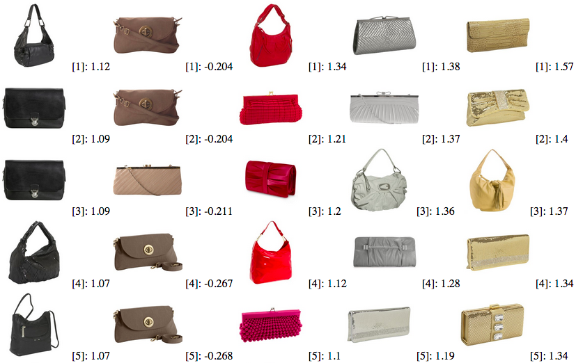
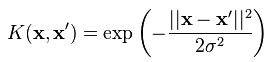
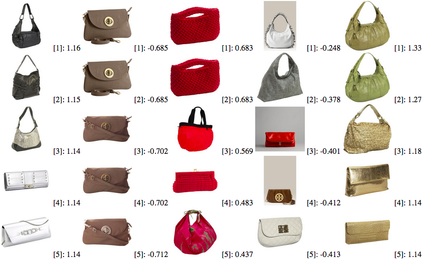
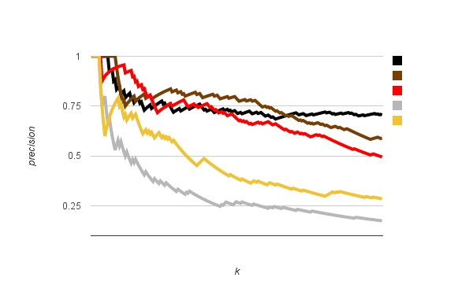

# bagscolor
A demo program of a retrieval system based on colors

## How to run this program?
### Prerequisites
- OpenCV
- Boost
- CMake

### Data
Bags image/text description used for this demo program can be found at http://www.tamaraberg.com/teaching/Spring_15/hw/hw2/bags.tar.gz

### Compile and run in command line

1. Download the dataset to your working directory
		
		wget http://www.tamaraberg.com/teaching/Spring_15/hw/hw2/bags.tar.gz
		
2. Unzip the file

		tar -zxvf bags.tar.gz

2. Download the repository

        git clone https://github.com/chunweiliu/bagscolor
        
3. Compile the source code
        
        cd bagscolor && mkdir build && cd build && cmake .. && make
        
4. Run the demo program

        ./demo ../../bags result.html 200

Here is an expected result for top 5 queries of the five color attributes: black, brown, red, silver, gold, associated with their meta data ([rank]: score):

## Overview of the program
1. Mining the image color tag to six different category: black, brown, red, silver, gold, and unknown, for the entire image set using the text description of each image
2. Separating the dataset to training and test set based on the mining results: The images associated with color tags are in the training set, the rest of images are in the testing set.
3. Computing HSV color histogram for each image as feature in training set (this program only used HS color histogram)
4. Training a binary SVM for each color attribute, total five SVMs
5. Applying each SVM on the test for five different color attributes 
6. Printing the result to a HTML page

### Cross-validation for the RBF Kernel

The sigma is important to the radial basis function (RBF) kernel (as the formula shown above).
The sigma can be determined using cross-validation.
This program performed a 5-fold cross-validation.
Without choosing an optimal sigma properly, for example, with a abitary sigma=3, the system still retrieved reasonable result, such as:

Yet, the result is far as good as the expected one.
For instance, the first column for the black attribute has some silver color purses.
Moreover, the fourth column for the silver attribute has a white bag, a red bag, and a brown bag.
This artifact might cased by the "background" of these three images are silver.
Having these artifacts in the top 5 lists is not good.
Cross-validation helps to improve the result.

I searched 20 `sigma`s, from 2^-10 to 2^9. 
The classification results did not change for `sigma` equals to 2^-10 to 2^-2.
Here is the classification error in percentage table of the five different labels (only shows `sigma` from 2^-1 to 2^9)

| log`sigma` | black | brown  | red    | silver  | gold |
| ---------- |:-----:|:------:|:------:|:-------:|:----:|
| -1         | 58.4  | 70     | 70     | 70      | 70
| 0          | 36    | 70     | 70     | 70      | 69.8
| 1          | **33**| 70     | 70     | 70      | 68.4
| 2          | 33.6  | 70     | 69.4   | 70      | 65.2
| 3          | 37    | 69.8   | 67.8   | 69.2    |**63.6**
| 4          | 39.2  |**69.6**| 67.8   |**67.4** | 63.6
| 5          | 40.8  | 69.6   |**67.6**| 67.4    | 64
| 6          | 40.8  | 69.6   | 67.8   | 67.4    | 64.4
| 7          | 43.2  | 70     | 68.6   | 68      | 64.6
| 8          | 48    | 69.6   | 69     | 68.4    | 65.8
| 9          | 53.6  | 69.8   | 69.2   | 68.8    | 67.6

The classification error seems high.
Yet when I look at the output result, the ranking seems pretty reasonable.

### Precision vs. number of query

This curve shows how much the top `k` queries are relevant (positive) to the color attribute.
Since we don't have ground truth labeling for the test data, I judged the result pretty subjectively.
The precision drops when increasing the query number.
Metal colors, such as silver and gold, dropped significant faster than the the nonmetal colors.
