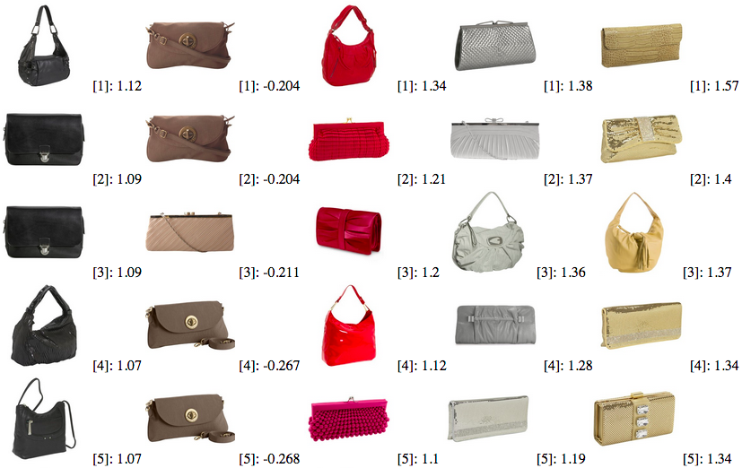
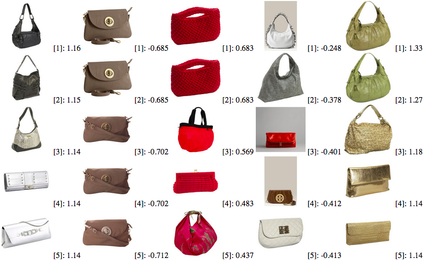
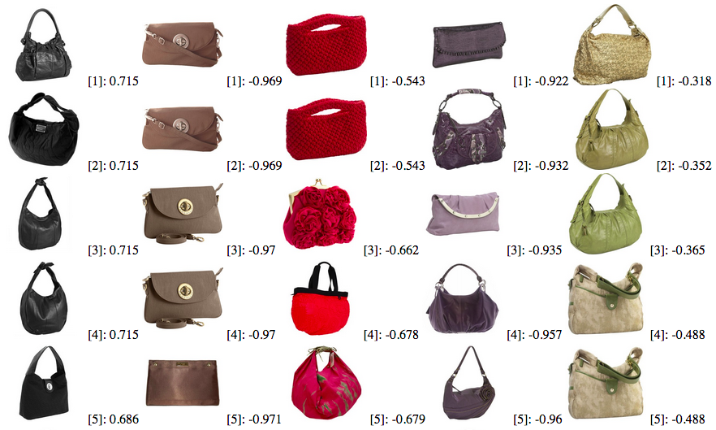
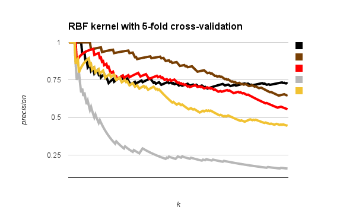
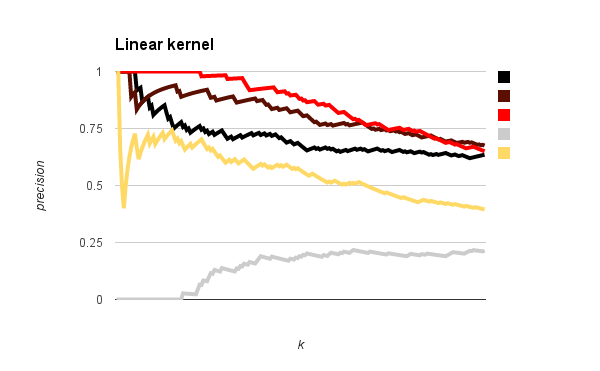

# bagscolor
A demo program of an image retrieval system using color attributes

### Prerequisites
- OpenCV 3.0
- Boost
- CMake

### Data
The bag images and text descriptions in the data folder was contributed by Tamara Berg at http://www.tamaraberg.com/teaching/Spring_15/hw/hw2/bags.tar.gz

### Demo

1. Download the repository

        git clone https://github.com/chunweiliu/bagscolor
        
2. Compile the source code
        
        cd bagscolor && mkdir build && cd build && cmake .. && make
        
3. Run the demo program

        ./demo ../data ../results/result.html 200

## Overview of this program
1. Mining the text description and tagging each image in the data folder to one of the six categories: black, brown, red, silver, gold, and unknown
2. Separating the data into two sets: for those images with color tags as training data, and those unknown images as test data.
3. Computing HS color histogram for each image as in the training set
4. Training five binary classifiers for each color attributes using Support Vector Machine (SVM)
5. Applying the five trained SVM on the test, and ranking the test images based on the SVM prediction scores
6. Printing the ranks from the top to the bottom to a HTML page

### Cross-validation for the RBF kernel

Radial basis function (RBF) kernel was applied to the SVMs.
The choice of sigma affects the ranking results a lot.
This program used 5-fold cross-validation to find the best sigma for each SVM.

Here is the result of the top five queries of the five color attributes: black, brown, red, silver, gold, associated with their meta data (in the format of [rank]: score):

**Top five lists from the RBF SVMs with 5-fold cross-validation**:

The parameter grid included 20 `sigma`s, from 2^-10 to 2^9. 
The cross-validation error rates were not different for `sigma` equals to 2^-10 to 2^-2.
They were all 70%.
Here is the classification error rate table of the five different labels (in percentage, only shows `sigma` from 2^-1 to 2^9)

**5-fold cross-validation error rates for the RBF SVM**

| log`sigma` | black | brown  | red    | silver  | gold 
| ---------- |:-----:|:------:|:------:|:-------:|:----:
| -1         | 58.4  | 70     | 70     | 70      | 70
| 0          | 36    | 70     | 70     | 70      | 69.8
| 1          | **33**| 70     | 70     | 70      | 68.4
| 2          | 33.6  | 70     | 69.4   | 70      | 65.2
| 3          | 37    | 69.8   | 67.8   | 69.2    |**63.6**
| 4          | 39.2  |**69.6**| 67.8   |**67.4** | 63.6
| 5          | 40.8  | 69.6   |**67.6**| 67.4    | 64
| 6          | 40.8  | 69.6   | 67.8   | 67.4    | 64.4
| 7          | 43.2  | 70     | 68.6   | 68      | 64.6
| 8          | 48    | 69.6   | 69     | 68.4    | 65.8
| 9          | 53.6  | 69.8   | 69.2   | 68.8    | 67.6
| Best log`sigma`| 1 | 4      | 5      | 4       | 3

The classification error were high.
However, the best `sigma`s which had the lowest error rank the list reasonable.
The entire 200 ranked lists is in the file "result/RBF.html".

Without choosing sigmas properly, for example, with an arbitrary `sigma=3`, the system still would get the lists:

**Top five lists from the RBF SVM with `sigma=3`**:

The result is far as good as the one with cross-validation.
For instance, the SVM for black ranked some silver color purses high.
Moreover, the SVM for silver ranked a red bag and a brown bag in its top-5, though these two images had a gray background, which is very similar to silver.

Let's now try the linear kernel:

**Top five lists from the linear SVM**:

The linear kernel performed well on nonmetal colors, but had troubles on metal colors.
There is even no one silver image in the top five list retrieved from the linear SVM for silver color.

### Precision vs. number of query
The precision curve shows how much the top `k` queries are relevant to the color attribute.
Since we don't have ground truth labeling for the test data, I judged the result by myself.
The process was pretty subjective.

The first figure shows the precision curves for the SVM with the RBF kernel.
The precision dropped when the query number `k` increase.
Metal colors, such as silver and gold, dropped significant faster than the the nonmetal colors.
The silver is the worse.
It probably because many bag images had gray background, which is pretty similar to silver on the HS color histogram.

The second figure shows the precision curves for the linear SVM.
The precision dropped when the query number `k` increase.
Metal colors, such as silver and gold, dropped significant faster than the the nonmetal colors.
Again, the silver is the worse.

Let's try to compare these two figures by overlapping them together.
The bolder curves are from the RBF figure and the thiner curves are from the linear figure.

For the black and brown colors, the precision has no significant different between the two curves when `k` is small.
When `k` is larger than 100, SVM with RBF kernel performed better than the linear kernel.

For the red color, linear SVM performed much better than the the RBF kernel.
Based on my observation from the retrieval result, the SVM with RBF kernel rank bags with red pattens, such as stripes or followers, on the top.
But I would not consider those are "red bags".
On the other hand, linear SVM rank bags with pure colors on the top.
Even though some of them are not "pure red" (e.g. they are pink), as a shopper, I consider those bags are more closed to what I want.

Both SVMs performed bad in the metal color cases.
Metal colors typically have lighten appearance, and this might be hard to distinguish from the HS color histogram.